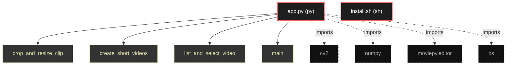

# Polyglot Codebase Knowledge Graph

> Generated offline by **readmenator**. Supports C, C++, Python, Go, Rust, JS/TS, Java, C#, Shell, PHP, Dart, GDScript, Nim, ASM.
> No LLMs. No tokens. Pure static analysis.

**Total Files Parsed:** 2 | **Total Symbols Extracted:** 4 | **Total Imports:** 4

## Structural Knowledge Map

---

## Architecture Reference

### PY (1 files)

#### `app.py`
**Path:** `app.py`

**Functions:**
- `crop_and_resize_clip` (line 18)
- `create_short_videos` (line 39)
- `list_and_select_video` (line 69)
- `main` (line 89)

### SH (1 files)

#### `install.sh`
**Path:** `install.sh`

*No symbols extracted*
